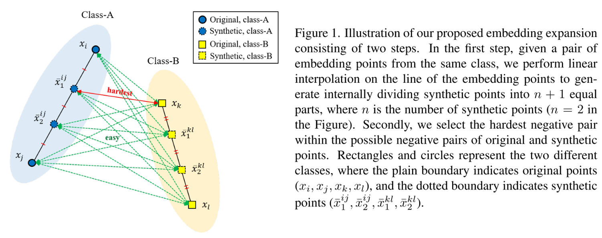
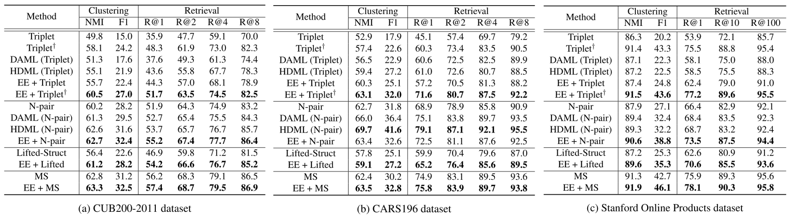
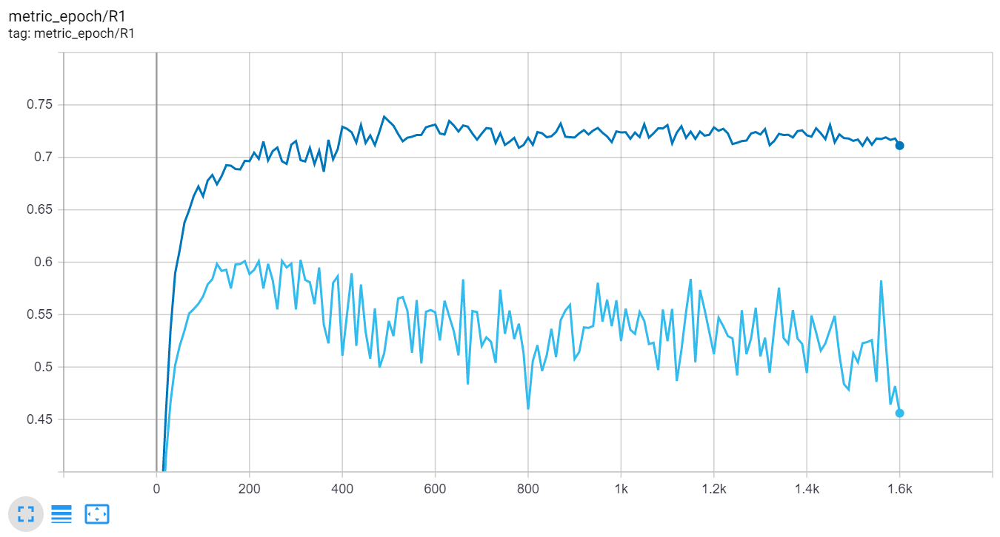

# Embedding Expansion: Augmentation in Embedding Space for Deep Metric Learning

Official MXNet implementation of Embedding Expansion: Augmentation in Embedding Space for Deep Metric Learning (CVPR 2020)

**Byungsoo Ko\*, Geonmo Gu\*** (* Authors contributed equally.)

@Clova Vision, NAVER/LINE Corp.

- [Paper](https://arxiv.org/abs/2003.02546) | [Supplementary Video](https://www.youtube.com/watch?v=5msMSXyQZ5U)

## Overview
### Embedding Expansion
*Embedding Expansion (EE)* is a novel augmentation method in embedding space which is compatible with existing pair-based metric learning losses.



### How it Works
By generating synthetic points with linear interpolation, they can contribute to training a network with augmented information.


### Experimental Results
Clustering and retrieval performance (%) on three benchmarks in comparison with other methods. † denotes the HPHN triplet loss, and bold numbers indicate the best score within the same loss.



## Getting Started

### Requirements

```
$ pip3 install -r requirements.txt
```

### Prepare Data

+ Download [CARS196](https://ai.stanford.edu/~jkrause/cars/car_dataset.html) dataset.

```
$ mkdir -p data/CARS_196
$ wget http://imagenet.stanford.edu/internal/car196/car_ims.tgz
$ tar -xvzf car_ims.tgz -C data/CARS_196
```

### Train Models

- **Available losses**: HPHN-triplet, EE + HPHN-triplet
  - Best recall@1 of EE + HPHN-triplet: 0.745 (0.716 in paper)

```
# EE + HPHN-triplet (n_inner_points=2)
$ python3 main.py --gpu_idx=0 --data_name=cars196 \
--backbone=googlenet --embed_dim=512 \
--loss=hphn_triplet --n_inner_pts=2 --ee_l2norm=True \
--seed=0 --batch_size=128 --image_size=227 \
--optim=adam --lr=0.0001 --lr_decay_factor=0.5 --lr_decay_epochs=400,800,1200,1600 \
--epochs=4000 --eval_epoch_term=5 --save_dir=results/inner-2

# HPHN-triplet (n_inner_points=0)
$ python3 main.py --gpu_idx=0 --data_name=cars196 \
--backbone=googlenet --embed_dim=512 \
--loss=hphn_triplet --n_inner_pts=0 --ee_l2norm=True \
--seed=0 --batch_size=128 --image_size=227 \
--optim=adam --lr=0.0001 --lr_decay_factor=0.5 --lr_decay_epochs=400,800,1200,1600 \
--epochs=4000 --eval_epoch_term=5 --save_dir=results/inner-0
```


### Check Test Results
```
$ tensorboard --logdir=results --port=10000
```



- dark blue: EE + HPHN-triplet (n_inner_points=2)
- sky blue: HPHN-triplet (n_inner_points=0)

 
## Citation
If you find *Embedding Expansion* useful in your research, please consider to cite the following paper.

```
@inproceedings{ko2020embedding,
    title={Embedding Expansion: Augmentation in Embedding Space for Deep Metric Learning},
    author={Ko, Byungsoo and Gu, Geonmo},
    booktitle={Proceedings of the IEEE Conference on Computer Vision and Pattern Recognition},
    year={2020}
}
```

## Acknowledgement
This repository is refactored based on the implementation of *Combination of Multiple Global Descriptors for Image Retrieval (CGD)*.
(Special thanks to the authors :D)

If you are interested in extended implementation of deep metric learning, please check the *CGD*'s repository and consider to cite the following paper.

- [Arxiv](https://arxiv.org/abs/1903.10663) | [Github](https://github.com/naver/cgd)

```
@article{jun2019combination,
  title={Combination of Multiple Global Descriptors for Image Retrieval},
  author={Jun, HeeJae and Ko, ByungSoo and Kim, Youngjoon and Kim, Insik and Kim, Jongtack},
  journal={arXiv preprint arXiv:1903.10663},
  year={2019}
}
```

## License

```
Copyright (c) 2020-present NAVER Corp.

Permission is hereby granted, free of charge, to any person obtaining a copy
of this software and associated documentation files (the "Software"), to deal
in the Software without restriction, including without limitation the rights
to use, copy, modify, merge, publish, distribute, sublicense, and/or sell
copies of the Software, and to permit persons to whom the Software is
furnished to do so, subject to the following conditions:

The above copyright notice and this permission notice shall be included in
all copies or substantial portions of the Software.

THE SOFTWARE IS PROVIDED "AS IS", WITHOUT WARRANTY OF ANY KIND, EXPRESS OR
IMPLIED, INCLUDING BUT NOT LIMITED TO THE WARRANTIES OF MERCHANTABILITY,
FITNESS FOR A PARTICULAR PURPOSE AND NONINFRINGEMENT.  IN NO EVENT SHALL THE
AUTHORS OR COPYRIGHT HOLDERS BE LIABLE FOR ANY CLAIM, DAMAGES OR OTHER
LIABILITY, WHETHER IN AN ACTION OF CONTRACT, TORT OR OTHERWISE, ARISING FROM,
OUT OF OR IN CONNECTION WITH THE SOFTWARE OR THE USE OR OTHER DEALINGS IN
THE SOFTWARE.
```
